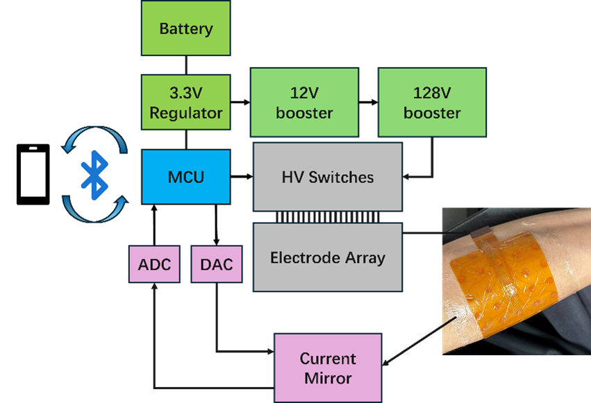
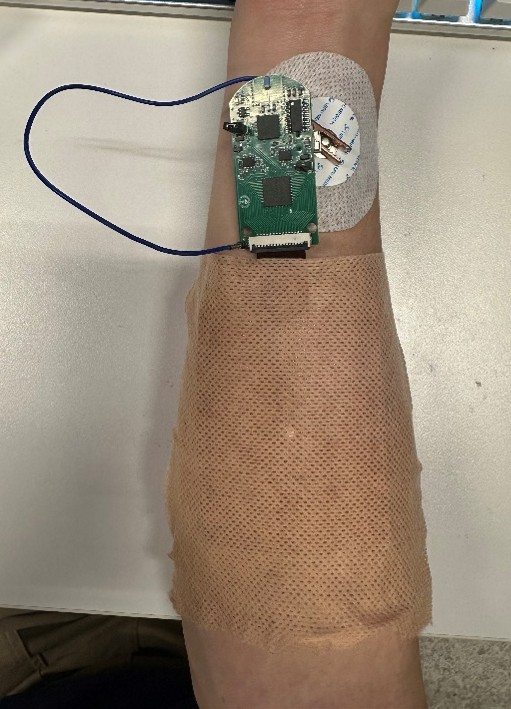
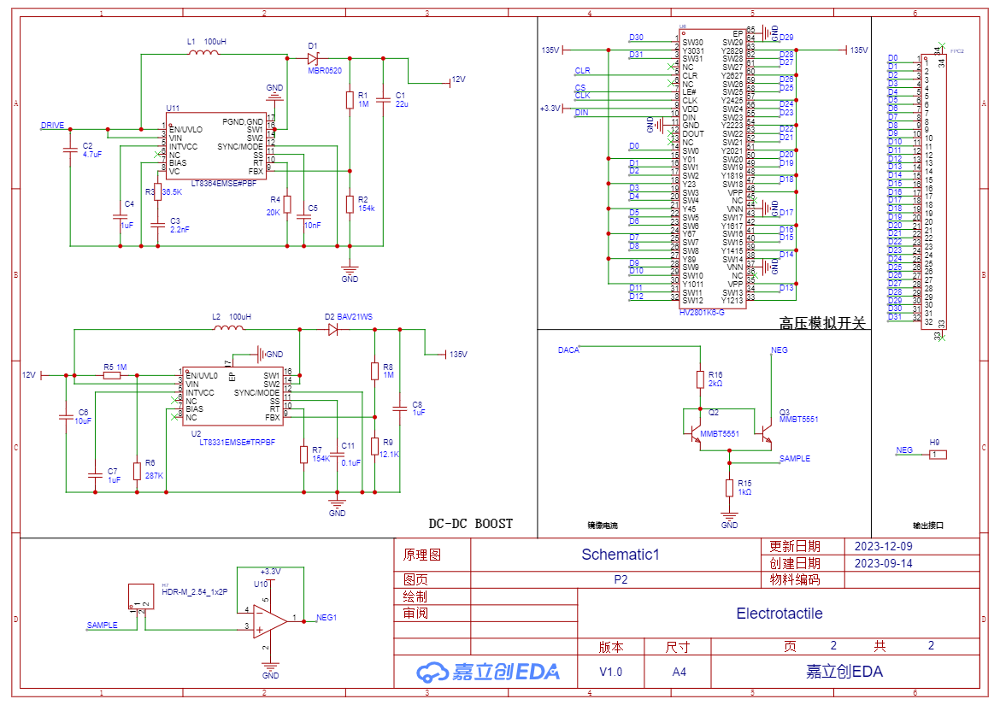
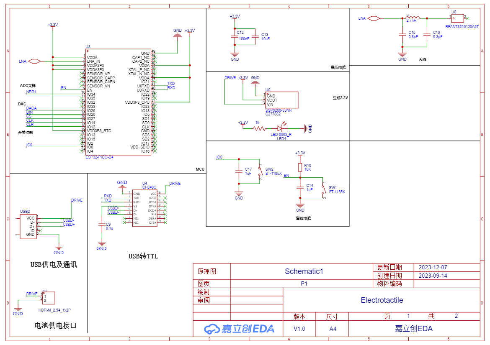

# Haptic Feedback Device based on Electric Stimulation
This project develops a skin-worn haptic feedback device capable of conveying essential information—such as walking directions—wirelessly to the user through tactile stimuli. By leveraging the sense of touch alone, users can perceive and interpret critical cues without relying on vision. This technology demonstrates promising potential for assisting visually impaired individuals in navigating real-world environments.
## Whole Schematic  
  

  

  
## Equipments
MCU: ESP32(codes in ESBoard package)  
PCB Design:  
  
  
